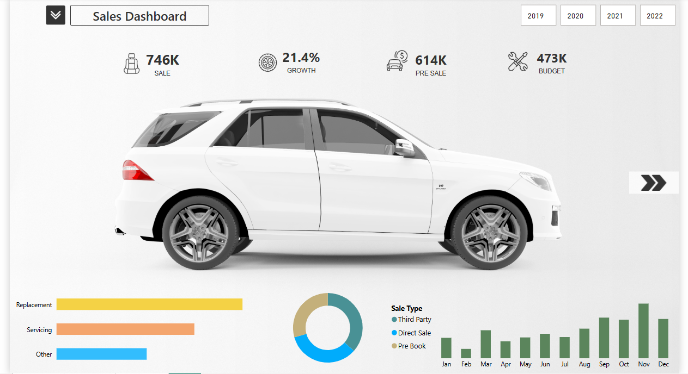
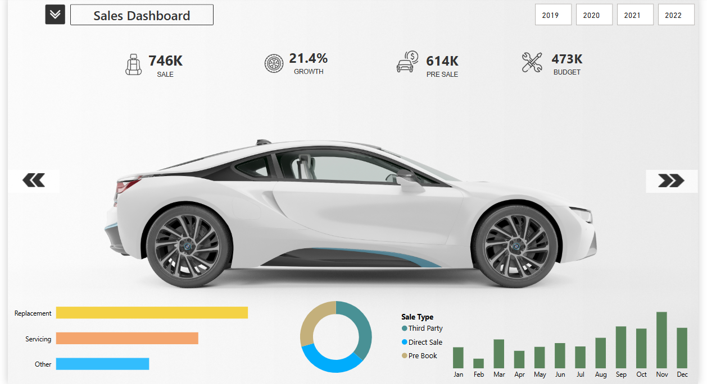
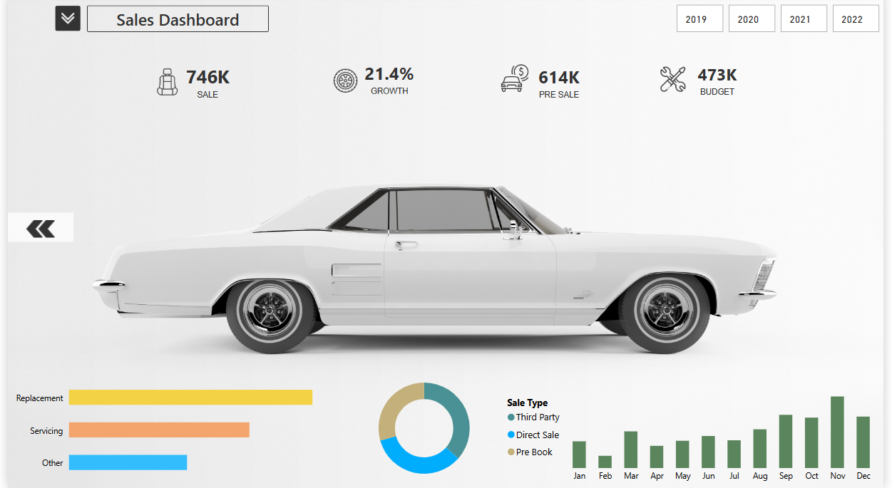

# 🚗 Car Sales Dashboard - Power BI

## 📌 Overview

This project is a **non-traditional interactive car sales dashboard** built in **Power BI**. It enables users to **analyze car sales performance** through an engaging, modern visual approach rather than conventional reports. Instead of using simple tables and bar charts, this dashboard incorporates **high-quality car images, interactive filters, and dynamic visual storytelling** to make the data more intuitive and visually appealing.

The dashboard allows users to explore **sales performance by year, type, and customer segment**, with real-time filtering options and **custom DAX formulas** that calculate key insights like sales growth, category mapping, and sales breakdowns.

---

## 📊 Dashboard Features

- **Sales Performance Metrics:** Track total sales, growth rate, and pre-booking statistics.
- **Dynamic Car Images:** Users can interact with different car models, displaying sales trends per model.
- **Yearly Sales Breakdown:** Toggle between **2019-2022** to analyze yearly trends.
- **Sales Type Segmentation:** Filter sales by **Direct Sale, Third Party, and Pre-Book**.
- **Customer Segmentation:** Analyze sales across **Replacement, Servicing, and Other** categories.
- **DAX-Driven Insights:** Custom **DAX formulas** power the calculations for accuracy and automation.
- **Video Demonstration:** [Watch the Dashboard Video](Dashboard_video.mp4)

---

## 🎥 Video Demonstration

The video demonstrates the dashboard's functionality, showcasing how users can:

- Interact with **different car models** to see their sales trends.
- Toggle between **years (2019-2022)** for comparison.
- Explore **sales types and customer segments** dynamically.
- Analyze real-time **sales growth and performance metrics**.

Click the link above to watch the full **walkthrough of the dashboard**.

---

## ⚡ DAX Formulas Explained

### **1️⃣ New_Categ (Sales Type Classification)**

```DAX
New_Categ =
VAR cate = New_Category[Category]
VAR _type = SWITCH(
    cate,
    "Office Supplies", "Direct Sale",
    "Technology", "Third Party",
    "Furniture", "Pre Book"
)
RETURN _type
```

## Sales Transaction Classification

This formula categorizes sales transactions based on the product category:

- **Office Supplies** → Direct Sale
- **Technology** → Third Party
- **Furniture** → Pre-Book

This classification helps in filtering and segmenting the sales data for detailed insights.

### **2️⃣ Seg (Customer Segment Classification)**

```
Seg =
VAR cate = New_City[Segment]
VAR _type = SWITCH(
    cate,
    "Consumer", "Replacement",
    "Home Office", "Other",
    "Corporate", "Servicing"
)
RETURN _type
Explanation:
This formula categorizes customer types into three segments:

```

## Customer Segmentation Formula

This formula categorizes customer types into three segments:

- **Consumer** → Replacement Sales
- **Home Office** → Other Sales
- **Corporate** → Servicing Sales

This helps in analyzing which customer segment contributes the most to overall sales.

### **3️⃣ Category_Switch (Custom Category Mapping)**

```
Category_Switch =
VAR cate = SELECTEDVALUE(Orders[Category])
VAR \_type = SWITCH(
TRUE(),
cate = "Office Supplies", "Digital Watch",
cate = "Furniture", "Analog Watch",
cate = "Technology", "Other"
)
RETURN \_type
```

## Product Category Renaming

This formula renames product categories to make them more intuitive:

- **Office Supplies** → Digital Watch
- **Furniture** → Analog Watch
- **Technology** → Other

This helps in providing a more user-friendly representation of categories in reports.

### **4️⃣ YTD_Sales (Year-to-Date Sales Calculation)**

```
Current_year_sales =
CALCULATE(
    SUM(Orders[Sales]),
    DATESYTD(Orders[Order Date])
)
```

## Year-to-Date (YTD) Sales Calculation

This formula calculates the total sales for the current year up to today’s date.

- Uses **DATESYTD()** to filter orders from the beginning of the year.
- Helps track how sales are progressing in real time.
  Sales_growth =

### **5️⃣ Sales_growth (Year-over-Year Sales Growth)**

```
DIVIDE(
    ([Current_year_sales] - [Previous_year_sales]),
    [Previous_year_sales]
)
```

This formula calculates sales growth compared to the previous year in percentage.

- **Positive value** → Indicates sales have increased.
- **Negative value** → Indicates sales have decreased.

This metric helps in understanding overall business performance and trends.

# 📊 Dashboard Sections Explained

## 🚗 Car Selection Panel

- Displays different car models dynamically.
- Clicking on a car filters the entire dashboard based on its sales.
- Uses high-quality images to enhance engagement.

### Car 1: Luxury SUV



- Represents high-end SUV sales.
- Ideal for analyzing replacement and servicing sales.

### Car 2: Sports Hybrid



- Showcases performance-based hybrid car sales.
- Helps understand pre-book and third-party sales.

### Car 3: Classic Vintage



- Reflects classic car sales performance.
- Useful for budget tracking and direct sales segmentation.

---

## 📈 Sales Performance Section

- Shows key sales KPIs like total revenue, pre-sales, and budget performance.
- Uses custom DAX calculations to provide real-time insights.

## 📅 Yearly Sales Toggle

- Users can switch between **2019, 2020, 2021, and 2022**.
- The dashboard updates dynamically to reflect year-over-year sales trends.

## 📌 Sales Type Breakdown

- Visualizes **Direct Sales, Third Party Sales, and Pre-Book Sales**.
- Users can filter data by selecting a specific sales type.

## 🎯 Customer Segmentation

- Displays sales performance based on **Replacement, Servicing, and Other** segments.
- Helps in identifying the most profitable customer group.

---

# 🚀 How to Use

1️⃣ **Open the Power BI file**  
2️⃣ **Select a car model** to analyze its sales impact  
3️⃣ **Use the year toggle** to compare performance over different years  
4️⃣ **Filter by sales type or customer segment** for deeper insights  
5️⃣ **Observe key metrics** like sales growth and performance trends

---

# 🔥 Future Improvements

📌 **AI-based Sales Forecasting**  
📊 **Real-time Data Integration**  
🚀 **Enhanced UX with More Animations & Interactions**

💡 _We welcome feedback & contributions to enhance this project!_ 🚀
