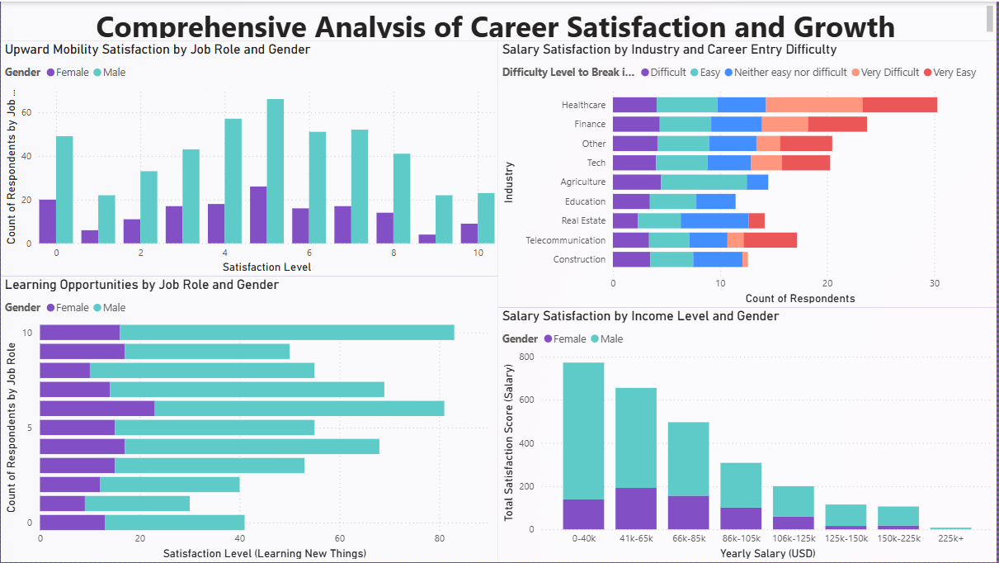

# Data Professional Career Insights

This project provides a comprehensive analysis of the data industry, focusing on salary trends, job satisfaction, and career growth opportunities. The insights are drawn from raw survey data collected by individuals, made available through Alex The Analyst's YouTube channel. This project aims to help aspiring and current data professionals understand industry trends, make informed career decisions, and enhance their job satisfaction.

---

## Inspiration and Motivation

With the rapid growth of the data industry, more people are pursuing careers as data analysts, data scientists, and other related roles. However, there is often uncertainty about salary expectations, job satisfaction, and career advancement opportunities. I chose this topic to bridge this knowledge gap and provide valuable insights into the world of data professionals. By analyzing survey data from real people in the industry, this project aims to offer a realistic view of what to expect and how to succeed in this field.

---

## Purpose of the Project

The primary goal of this project is to analyze and visualize key aspects of data-related careers. By leveraging raw survey data, this project seeks to provide valuable insights into the following areas:

- Salary comparisons by job title and gender
- Employee happiness with salary and work-life balance
- Programming language popularity among data professionals
- Industry distribution and career entry difficulty
- Upward mobility, learning opportunities, and overall job satisfaction

---

## Data Source

The raw data used in this project was collected by individuals and shared through **Alex The Analyst's YouTube channel.** The dataset provides an authentic glimpse into the experiences and perspectives of data professionals worldwide.

---

## Dashboards Overview

### 1. Key Findings from the Data Professional Survey

This dashboard provides a high-level overview of the survey results, including:

- Countries with the most server users
- Salary comparison by job title
- Most popular programming languages
- Employee happiness with salary and work-life balance
- Male vs. Female salary insights

**Questions Answered:**

- Which countries have the most server users?
- How do salaries compare across different job titles?
- What are the most popular programming languages among data professionals?
- How happy are employees with their salary and work-life balance?
- What is the salary difference between male and female data professionals?

---

### 2. Gender-Based Job Satisfaction and Industry Analysis

This dashboard focuses on gender-based insights, including:

- Salary satisfaction by favorite programming language
- Gender-based satisfaction with management by job title
- Gender distribution across industries
- Overall salary satisfaction by gender

**Questions Answered:**

- Which programming languages are preferred by different genders?
- Do male and female professionals feel differently about management?
- Which industries have the most gender diversity?
- Is there a gender disparity in salary satisfaction?

---

### 3. Comprehensive Analysis of Career Satisfaction and Growth

This dashboard delves into career growth and satisfaction metrics, including:

- Upward mobility satisfaction by job role and gender
- Learning opportunities by job role and gender
- Salary satisfaction by industry and career entry difficulty
- Salary satisfaction by income level and gender

**Questions Answered:**

- Do employees feel they have upward mobility in their roles?
- Are learning opportunities distributed equally across roles and genders?
- Does career entry difficulty impact salary satisfaction?
- Are there income disparities based on gender and industry?

---

## Key Questions Answered

- Which countries have the most server users?
- How do salaries compare across different job titles?
- What are the most popular programming languages among data professionals?
- How happy are employees with their salary and work-life balance?
- What is the salary difference between male and female data professionals?
- How satisfied are data professionals with management, and does it vary by gender?
- Which industries have the most gender diversity?
- Is it difficult to break into certain industries within the data field?
- What are the opportunities for learning and career growth in data roles?

---

## Tools Used

- **Microsoft Power BI** for data visualization and dashboard creation
- **Data cleaning and preprocessing techniques** to ensure data accuracy and reliability

---

## Conclusion

This project serves as a valuable resource for anyone interested in pursuing a career in data. By analyzing key aspects of the data industry, it provides actionable insights that can guide career decisions and enhance job satisfaction. The findings also contribute to a better understanding of gender dynamics and industry distribution within the data profession.

---

## Acknowledgments

Special thanks to **Alex The Analyst** for providing the raw data and inspiring this project.

---

## Contact

For any questions or feedback, feel free to reach out to the project creator.
