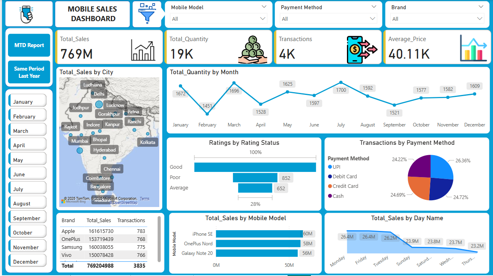

# 📊 Mobile Sales Dashboard

## 📌 Project Overview

The **Mobile Sales Dashboard** is an interactive Power BI report designed to analyze mobile phone sales trends, customer purchasing behaviors, and transaction methods. The dashboard provides a detailed view of total sales, quantity sold, transactions, and average price across different brands, payment methods, and time periods.

This project enables businesses to gain valuable insights to make data-driven decisions, optimize pricing strategies, and improve sales performance.

## 🚀 Why This Project?

- To monitor and track mobile sales trends across different dimensions such as **brand, payment method, and time**.
- To **compare sales performance** with the same period last year.
- To analyze **regional sales distribution** and understand which cities drive the most revenue.
- To optimize business strategies based on data-driven insights.

## ❓ Key Questions Answered

- 📈 **How are total sales and transactions distributed across different brands?**
- 💳 **Which payment methods are preferred by customers, and how do they impact sales?**
- 🔄 **How does the current sales performance compare with the same period last year?**
- 🌎 **Which cities and mobile models contribute the most to total sales?**
- 📅 **How do sales trends fluctuate across different months and quarters?**

---

## 📊 Dashboard Screenshots & Explanations

### **1️⃣ Overall Sales Performance Dashboard**



This dashboard provides an **overview of mobile sales performance** with key metrics such as:

- **Total Sales (769M)**
- **Total Quantity Sold (19K)**
- **Total Transactions (4K)**
- **Average Price per Unit (40.11K)**  
  🔹 The dashboard also includes:
- **Sales distribution by city** (interactive map)
- **Sales trends over months**
- **Breakdown of payment methods used**
- **Mobile model-wise total sales**
- **Day-wise total sales trends**

---

### **2️⃣ Month-to-Date (MTD) Sales Trends**


This report tracks **Month-to-Date (MTD) sales**, showing:

- **Total Sales (23M)**
- **Total Quantity Sold (588)**
- **Transactions (110)**
- **Average Price per Unit (39.95K)**  
  📊 The line chart visualizes the **MTD growth trend**, helping businesses monitor sales progress in real time.

---

### **3️⃣ Sales Performance Compared to Last Year (SPLY)**


This dashboard compares current **total sales performance** with the **same period last year (SPLY)** to analyze trends and growth.

- 📊 **Quarterly and Monthly Sales Comparison**
- 🔍 **Identifies patterns in sales growth/decline**
- 🎯 **Helps businesses evaluate seasonal performance**

---

## 🔮 Future Scope

- **Predictive Analysis**: Implement machine learning models to forecast future sales trends.
- **Customer Segmentation**: Use clustering techniques to group customers based on buying patterns.
- **Inventory Optimization**: Help businesses stock the right products based on demand.
- **Automated Reporting**: Set up scheduled Power BI reports for real-time updates.

## ❓ Key Business Questions Answered

1. What are the **total sales and transactions** for different mobile brands?
2. How have sales **trended over time (monthly, quarterly, yearly)?**
3. What is the **average sales price** for different mobile models?
4. Which **cities contribute the most** to mobile sales?
5. What is the **preferred payment method** among customers?
6. How do **current sales compare to the same period last year?**
7. What are **customer rating trends**, and how do they impact sales?

## 🧮 DAX Formulas Used

Here are some key **DAX formulas** used in the Power BI dashboard:

```DAX
-- Total Sales Calculation
Total_Sales = SUM(Sales[Amount])
```

```
-- Total Transactions
Total_Transactions = COUNT(Sales[Transaction_ID])

```

```
-- Average Sales Price
Average_Price = DIVIDE([Total_Sales], [Total_Transactions], 0)

```

```
-- Total Sales (MTD)
Total_Sales_MTD = TOTALMTD([Total_Sales], Sales[Date])

```

```
-- Total Sales (Same Period Last Year)
Total_Sales_SPLY = CALCULATE([Total_Sales], SAMEPERIODLASTYEAR(Sales[Date]))

```

```
-- Sales Growth % (YoY)
Sales_Growth_YoY =
VAR LastYearSales = [Total_Sales_SPLY]
RETURN IF(LastYearSales = 0, BLANK(), ([Total_Sales] - LastYearSales) / LastYearSales)

```

---

📢 If you find this useful, don’t forget to ⭐ **star the repository!** 🚀
